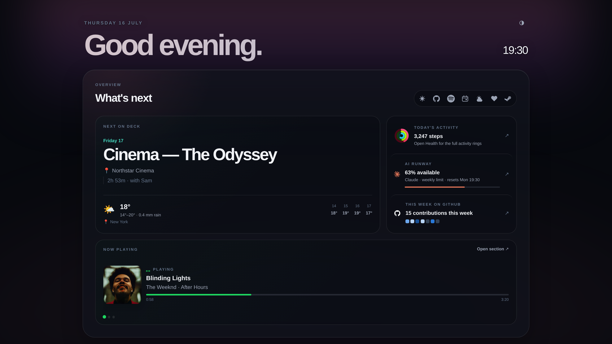
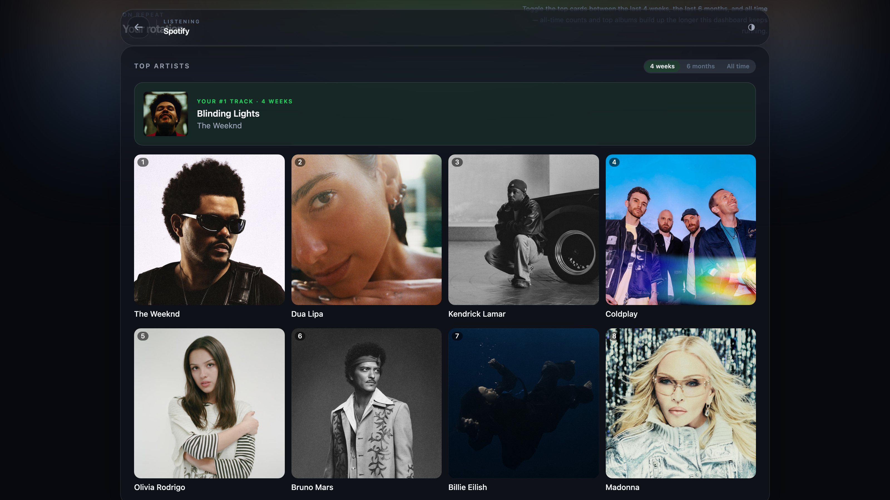
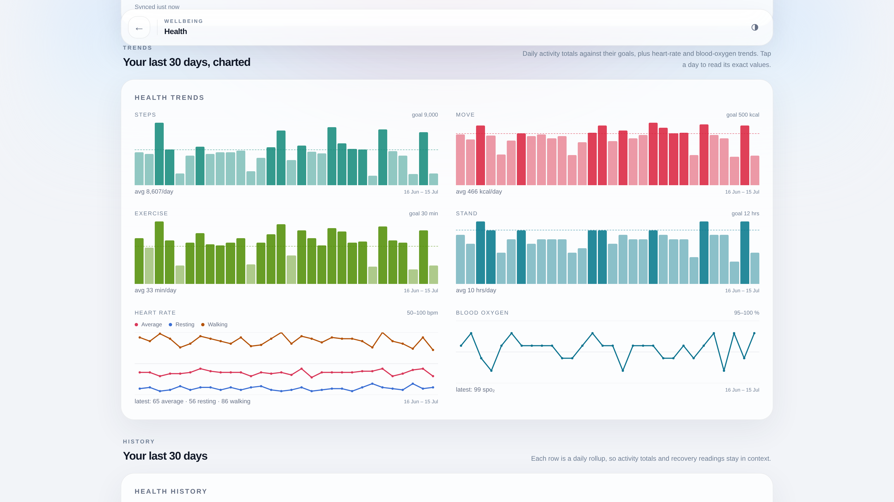
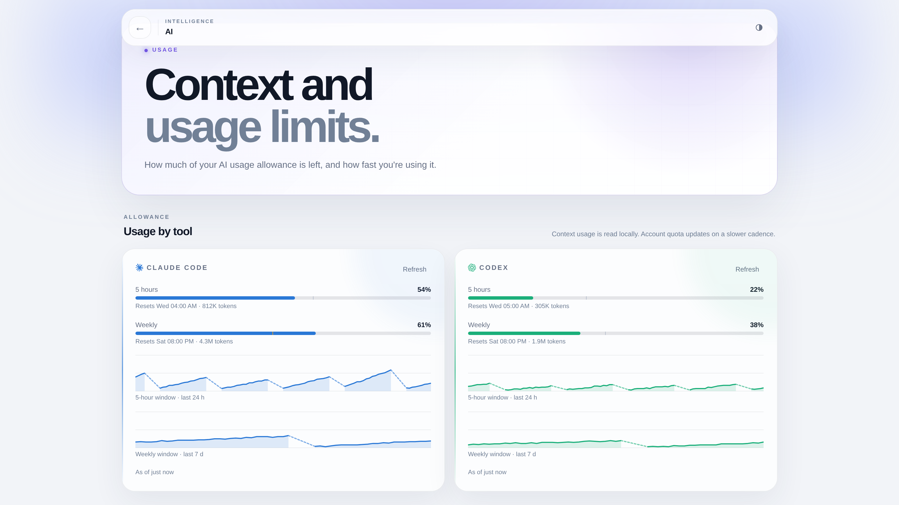
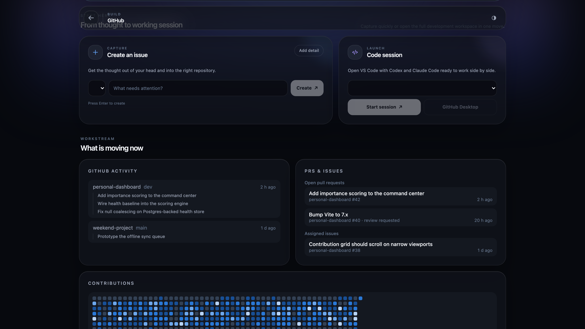

# Personal Dashboard

One glanceable page for life + dev: weather, calendar, email, GitHub, transit departures,
electricity prices, and AI usage. Runs locally on
your own machine (macOS or Windows) and is just a web app at `localhost:4821`: open it in a browser
and you're done.

Everything beyond that is optional. [Tailscale](https://tailscale.com) is only needed to reach it
*from your phone*; without it the dashboard works fine on the machine it runs on. Individual widgets
have their own requirements (iMessage is macOS-only, Health needs an iPhone Shortcut), and any
widget you don't configure simply shows as "not configured" rather than breaking the page.

## Screenshots

<p align="center">
  
  <br>
  <em>Overview: the command center picks its own hero and tiles by importance, not a fixed layout — tap a tile to jump straight to its widget</em>
</p>

<p align="center">
  
  <br>
  <em>Spotify: now playing, top artists, top tracks, and all-time stats</em>
</p>

<p align="center">
  
  <br>
  <em>Health: 30-day trends charted against your goals, from an Apple Health Shortcut</em>
</p>

<p align="center">
  
  <br>
  <em>AI usage: Claude Code and Codex allowance, with resets visible as gaps in the history</em>
</p>

<p align="center">
  
  <br>
  <em>GitHub: capture an issue, launch a coding session, and see what's moving across your repos</em>
</p>

*(Screenshots are generated from fake, anonymized data via [`server/scripts/screenshots.ts`](server/scripts/screenshots.ts), and kept up to date automatically by [`.github/workflows/screenshots.yml`](.github/workflows/screenshots.yml).)*

## Stack

npm-workspaces monorepo:

- **`client/`**: React + Vite + Tailwind SPA with a PWA manifest (install to phone home screen).
- **`server/`**: Express on `127.0.0.1:4821`. Each data source is a *provider* polled on its own interval; results are schema-validated (zod) and cached in memory. Widgets read the cache via `/api/widgets/:id`.
- **`shared/`**: zod schemas + types shared by both.

Persistent health, AI-usage, and Spotify history live in Railway Postgres so dashboard installs on
different machines see the same history. The connection string remains in ignored `server/.env`;
credentials and OAuth tokens stay in ignored `server/.tokens/`, while local-only layout state remains
in `server/.data/`.

## Shared Postgres setup

`DATABASE_URL` is required. Set it to Railway's **public** Postgres URL (not the internal
`postgres.railway.internal` URL, which only works from Railway services), then migrate:

```bash
npm run db:migrate -w server
```

For an existing installation, stop every dashboard server first, back up each machine's
`server/.data/`, choose the authoritative history source, and import it explicitly:

```bash
npm run db:import-json -w server -- /path/to/server/.data
```

The importer is idempotent for the same export. Keep the JSON backups as rollback material; do not
run two old JSON-backed dashboard versions while performing the cutover.

## Getting started

```bash
npm install
cp server/.env.example server/.env              # fill in what you want enabled
cp server/config.example.json server/config.json  # optional, defaults are fine
npm run dev                                     # server :4822 + client :5173
```

Widgets without credentials show as "not configured" instead of breaking; enable them one at a time.

Production mode (server serves the built client at `http://localhost:4821`):

```bash
npm run build
npm start
```

## Run at login

**macOS**: installs a launchd agent that keeps `npm start` running and restarts it at login:

```bash
./scripts/install-launchd.sh
```

Production runs from its own **deploy clone** (`~/.local/share/personal-dashboard/repo`), not from
your working copy, so a dirty tree or a WIP branch can't take down the dashboard your phone is
looking at. Credentials and fetched data (`.env`, `config.json`, `.tokens/`, `.data/`) are moved once
into `~/.local/share/personal-dashboard/state` and symlinked into both checkouts, so the two share a
single set of OAuth tokens: keeping two copies would mean two clients refreshing the same grant, and
Spotify and Hue rotate refresh tokens on use, so one copy would eventually be left with a dead token.

Opt in to auto-update and a second agent polls your `origin/main` every 5 minutes, hard-resets the
deploy clone to it and restarts, so merging to `main` updates the dashboard on your phone by itself:

```bash
PD_AUTO_UPDATE=1 ./scripts/install-launchd.sh     # PD_UPDATE_INTERVAL=300 to change the cadence
```

Installing it is the one manual step, and it has to be: nothing here listens for inbound connections,
so GitHub can't reach into your machine to start anything; something has to run locally once. After
that it's hands-off. The updater refreshes its own copy too, so a commit that changes the update
script still lands by itself; only a change to the launchd agents themselves (the poll interval, say)
needs the installer re-run.

**Windows**: two options:

- *Startup shortcut*: `Win+R` → `shell:startup` → add a shortcut with target
  `cmd /c "cd /d C:\path\to\Personal-Dashboard && npm start"` (runs with a visible console).
- *Task Scheduler* (headless): create a task triggered **At log on**, action `cmd`, arguments
  `/c cd /d C:\path\to\Personal-Dashboard && npm start`, and tick "Run whether user is logged on or not".

Run `npm run build` once first on Windows so `client/dist` exists.

## Phone access (Tailscale Serve)

The server binds to loopback only. To reach it from your phone:

```bash
tailscale serve 4821
```

This proxies the dashboard onto your tailnet with HTTPS (required for PWA install). Requirements: Tailscale installed and signed in on this machine and on your phone (same tailnet), and HTTPS certificates enabled once in the [admin console](https://login.tailscale.com/admin/dns) (Enable HTTPS).

On the phone, open the printed `https://<machine>.<tailnet>.ts.net` URL in Safari and use Share → **Add to Home Screen**: the dashboard then launches fullscreen like an app. Both your Mac and Windows PC can serve their own instance; the phone just bookmarks each machine's URL.

Setting `HOST=0.0.0.0` instead exposes the dashboard **unauthenticated** on your LAN; only do that on networks you trust.

## Checks

```bash
npm run typecheck   # tsc --noEmit in all workspaces
npm test            # vitest (scheduler/cache behavior)
```

## Widget setup

### Weather (MET Norway)

No key needed: set `WEATHER_LAT` / `WEATHER_LON` in `server/.env`.

### Transit departures (Entur — Norway)

No key needed. With `WEATHER_LAT` / `WEATHER_LON` set, the widget automatically shows real-time
departures from the stops nearest those coordinates, using [Entur](https://developer.entur.org)'s
national journey-planner API (covers every Norwegian operator: AtB, Ruter, Skyss, …). When the
dashboard PWA shares your phone's location, the stops follow you the same way weather does.

To make specific stops (e.g. the ones you actually take, which auto-discovery might skip in favor
of a nearer but less useful stop) take priority, list their NSR ids in `server/config.json` under
`transit.stopIds` — find ids at [stoppested.entur.org](https://stoppested.entur.org) (they look
like `NSR:StopPlace:41613`). These are shown whenever you're within `transit.favoriteRadiusMeters`
(default 5 km) of one of them; if you're not near any of them right now, it falls back to
auto-discovery, capped at `transit.maxStops` stops within `transit.nearbyRadiusMeters` (default
2 km). `transit.departuresPerStop` tunes how much the card shows per stop.

### Electricity spot price (Norway)

No key needed. With `WEATHER_LAT` / `WEATHER_LON` set (or the dashboard PWA sharing your phone's
location), the widget auto-detects your [bidding area](https://www.nordpoolgroup.com/en/maps/)
(`NO1` Øst … `NO5` Vest) from those coordinates via Entur's reverse geocoder, the same way transit
follows the dashboard's location.

To pin a specific area instead (e.g. it's wrong near a zone border, or you want a location other
than your own), set it explicitly in `server/config.json` — this always overrides auto-detection:

```json
{ "power": { "area": "NO3" } }
```

The card charts today's (and, after ~13:00, tomorrow's) hourly Nord Pool spot price from the free
[Hva koster strømmen.no](https://www.hvakosterstrommen.no/strompris-api) API, and the command
center gets "price spike now" / "cheaper power ahead" signals. Prices are the raw day-ahead spot
price — grid rent, taxes, and strømstøtte are not included.

### GitHub

Set `GITHUB_USERNAME` and `GITHUB_TOKEN` in `server/.env`. Create a **classic PAT** (github.com → Settings → Developer settings) with the `repo` scope. A fine-grained PAT does not work here: `GET /users/{username}/events` (used for the activity feed) doesn't support fine-grained PATs at all, so private-repo activity silently never shows up.

The repo-health card shows all your owned, non-fork, non-archived repos, fetched live from the GitHub API; there's no pinned-repo list to maintain in `server/config.json`.

Optionally set `GITHUB_ISSUES_TOKEN` for the **capture issue** button (creates an issue on a repo from the dashboard). Falls back to `GITHUB_TOKEN` when unset, so it only needs setting if you want the issue-creation token scoped differently from the read/activity one.

Note: the activity feed uses GitHub's events API, which is **delayed** (typically minutes); it is not real-time.

### AI usage (Claude Code / Codex)

Each service has its own card showing its current rolling allowance: **five-hour** and **weekly** percentages, with reset times, not token totals or estimated costs. A thin marker on each bar shows where usage "should" be if it tracked evenly with the window's elapsed time; the marker turns amber when usage is running ahead of that pace.

- **Codex:** no setup when Codex is signed in locally; its local session snapshots contain the current account limits. This card polls those local files only (no network call), so it refreshes independently and much more often than Claude; tune the interval with `aiUsage.codexRefreshMs` (ms, default `30000`) in `server/config.json`.
- **Claude Code:** no setup beyond having the `claude` CLI signed in locally on this machine. The card shells out to `claude -p "/usage"` (the same local command `/usage` runs inside an interactive session) and parses its report. This is free and reliable, unlike the account-wide quota endpoint, which turned out to be rate-limited to the point of never returning a usable reading from server-side automation. Each call writes a small local session transcript file, so this card refreshes on a coarser cadence than Codex; tune it with `aiUsage.claudeRefreshMs` (ms, default `900000` / 15 min) in `server/config.json`.

Each machine's dashboard reports that machine's signed-in accounts only.

### News

No key needed, no defaults — both feed lists start empty until you add RSS feeds in `server/config.json`:

- `news.feeds`: general-purpose RSS feeds (e.g. Hacker News), shown in the Personal section.
- `aiNews.feeds`: RSS feeds each tagged with a `provider` (`"openai"` or `"anthropic"`), shown in the AI usage section alongside the Claude Code / Codex allowance cards.

```json
{
  "news": { "feeds": [{ "name": "Hacker News", "url": "https://news.ycombinator.com/rss" }] },
  "aiNews": {
    "feeds": [
      { "name": "OpenAI", "url": "https://openai.com/news/rss.xml", "provider": "openai" },
      { "name": "Anthropic", "url": "https://news.google.com/rss/search?q=site:anthropic.com/news&hl=en-US&gl=US&ceid=US:en", "provider": "anthropic" }
    ]
  }
}
```

### Calendar (iCloud / Apple Calendar)

1. Go to [account.apple.com](https://account.apple.com) → Sign-In and Security → **App-Specific Passwords** → generate one (call it e.g. `dashboard`).
2. Set in `server/.env`:
   - `ICLOUD_USERNAME`: your Apple ID email
   - `ICLOUD_APP_PASSWORD`: the generated `xxxx-xxxx-xxxx-xxxx` password

By default all event calendars are shown; to limit it, list display names in `server/config.json` under `calendar.allowlist` (e.g. `["Personal", "NTNU"]`).

### Gmail

One-time setup:

1. In [console.cloud.google.com](https://console.cloud.google.com), create a project (e.g. `personal-dashboard`), enable the **Gmail API**, and configure the OAuth consent screen.
2. Create an OAuth client of type **Desktop app**; put its ID/secret in `server/.env` as `GOOGLE_CLIENT_ID` / `GOOGLE_CLIENT_SECRET`.
3. Run `npm run setup:gmail -w server`, open the printed URL, approve. The refresh token is saved to `server/.tokens/gmail.json` (owner-only permissions); restart the server.

The widget requests only the **`gmail.metadata`** scope: message headers and labels, never bodies.

⚠️ **Testing-mode expiry**: while the OAuth consent screen is in *Testing* status, Google expires refresh tokens after **7 days** and you'd have to re-run setup weekly. Fix: on the consent screen page, add yourself as a test user, then **publish** the app (it can stay unverified; only your own account uses it); published apps get long-lived refresh tokens.

### Spotify

One-time setup:

1. In [developer.spotify.com](https://developer.spotify.com/dashboard), create an app; put its Client ID/secret in `server/.env` as `SPOTIFY_CLIENT_ID` / `SPOTIFY_CLIENT_SECRET`.
2. Run `npm run setup:spotify -w server`. It prints an exact redirect URI (`http://127.0.0.1:8888/callback`); add that under the app's **Settings → Redirect URIs** and save.
3. Open the printed authorize URL, approve. The refresh token is saved to `server/.tokens/spotify.json` (owner-only permissions); restart the server.

Read-only scopes (`user-read-currently-playing`, `user-read-recently-played`, `user-top-read`) power the Spotify section: now playing, recently played, and top artists/tracks over the last 4 weeks / 6 months / all time. Spotify's API has no all-time or top-albums endpoint, so those are seeded once from Spotify's long_term (multi-year) top lists and then grown from observed plays in the shared Postgres history.

### Steam

1. Create a Steam Web API key at [steamcommunity.com/dev/apikey](https://steamcommunity.com/dev/apikey) (any domain name works — the key is only ever used server-side).
2. Find your SteamID64: open your Steam profile in a browser and use a lookup tool such as [steamid.io](https://steamid.io) rather than pasting the API key into any third-party site.
3. Set `STEAM_API_KEY` and `STEAM_ID` in `server/.env`, then restart the server.

Steam's own privacy settings gate what the widget can show: **Game details** must be public for library totals and achievement progress, and **Friends list** visibility determines whether the friends-playing signal works — with either set to private, that part of the widget degrades to a quiet empty state rather than failing. The integration is read-only (it never writes to your Steam account) and the API key is only ever used server-side, never sent to the browser.

### Roblox

Sits alongside Steam and Clash Royale as a tab on the Games page.

1. Set `ROBLOX_ID` in `server/.env` to your Roblox username or numeric user ID.
2. Restart the server. Profile, friends count, badges, and games you've created show up immediately — all read from Roblox's public, unauthenticated endpoints.

Presence (what you're playing right now) and favorited games additionally need `ROBLOSECURITY`, a full-account session cookie (not a scoped API key — anyone holding it can act as your account, no 2FA required, since it *is* an already-logged-in session):

1. Log into roblox.com in a browser, open DevTools → Application/Storage → Cookies → `roblox.com`, and copy the full value of `.ROBLOSECURITY` — including the `_|WARNING:-DO-NOT-SHARE-THIS...|_` prefix, which is part of the literal value, not a comment.
2. Set `ROBLOSECURITY` in `server/.env`.

It expires/rotates periodically (faster if the requesting IP differs from where it was issued — running the dashboard from the same home network you copied it from helps), so expect to redo this occasionally; a run of 401s from the Roblox widget after it's been working means the cookie is dead, not a bug. Revoke it anytime by logging out of all Roblox sessions or changing your password.

### Clash Royale

1. Create an API key at [developer.clashroyale.com](https://developer.clashroyale.com) — keys are locked to the public IP address making requests (not a redirect URI like the OAuth integrations below; Supercell's API checks the source IP on every request, and there's no wildcard/CIDR option), so use the IP the dashboard server actually runs from.
2. Set `CLASH_ROYALE_API_KEY` and `CLASH_ROYALE_ID` (your player tag, e.g. `#ABC123`) in `server/.env`, then restart the server.

Read-only: player profile, current deck, upcoming chest cycle, and recent battle log.

If the server's public IP changes (dynamic ISP address, or the machine moves between networks), requests start failing with HTTP 403 until you update the allowlist at developer.clashroyale.com — the server logs its current public IP once at startup (`[clash-royale] server's current public IP is ...`) as a quick copy-paste source when that happens.

### SonarCloud

Shows up as a "Code quality" block at the bottom of the GitHub page, listing every project in your org with its quality gate status, ratings, coverage, and duplication — one card per repo.

1. Generate a user token at [sonarcloud.io/account/security](https://sonarcloud.io/account/security).
2. Set `SONARCLOUD_TOKEN` and `SONARCLOUD_ORG` (the `key` in `sonarcloud.io/organizations/<key>`) in `server/.env`, then restart the server.

Every project in the org is shown; there's no per-repo allowlist.

### Philips Hue

Lights go through Philips' cloud (the official [Remote API](https://developers.meethue.com)), the same path the Hue phone app uses, so the widget works no matter what network the Mac is on. The bridge's LAN IP is not involved.

One-time setup:

1. Create a free developer account at [developers.meethue.com](https://developers.meethue.com), then under **My Apps** create a new Remote Hue API app. Set the **Callback URL** to exactly `http://127.0.0.1:8842/callback`.
2. Put the app's credentials in `server/.env` as `HUE_CLIENT_ID` / `HUE_CLIENT_SECRET`.
3. Run `npm run setup:hue -w server`, open the printed URL, log in with your Philips Hue account and approve. The script exchanges the OAuth code and remotely provisions a bridge allowlist user (the cloud equivalent of pressing the link button), saving both to `server/.tokens/hue.json` (owner-only permissions).
4. Restart the server: like every env-configured widget, Hue is only checked at startup.

Control is read + write: toggling a light, dragging its brightness slider, or tapping one of your Hue app scenes (shown as chips grouped by room) sends the change through the cloud to the bridge. Access tokens auto-refresh; if the widget stops working after months of the server being off, the refresh token has expired; re-run step 3.

### iMessage (macOS only)

Reads `~/Library/Messages/chat.db` directly (read-only), no setup beyond granting **Full Disk Access**:

1. System Settings → Privacy & Security → **Full Disk Access**.
2. Add the process that actually reads the file, not just "Terminal" in the abstract:
   - Running via `npm run dev` from Terminal.app or iTerm: add that terminal app.
   - Running via the `install-launchd.sh` agent: launchd execs `node` directly with no GUI parent, so add the **node binary itself** (find it with `which node`, e.g. `/opt/homebrew/bin/node`).
3. Restart the server: granting access mid-session doesn't retroactively enable the widget.

Shows the most recent message per conversation and an unread count. Personal chat handles are resolved through the local macOS Contacts database, while group/business display names come from Messages; unresolved handles fall back to their phone number or email. Modern `attributedBody` message text is decoded, and attachment-only messages show as `[attachment]`.

⚠️ **Privacy**: message previews are cached server-side and served to any device that reaches this dashboard, i.e. your phone over Tailscale, not just something read and kept on the Mac.

### Health (Apple Health via Shortcut)

Apple Health can't be read from a server, so the phone pushes to the dashboard instead. There's no
external setup and no credentials; the widget appears immediately (empty until the first post) and
is fed by an **Apple Shortcut** you build once.

Build a Shortcut (and, optionally, a Personal Automation that runs it on a schedule) that:

1. Uses **Get Health Sample / Find Health Samples** actions to read today's totals (steps, active
   energy, exercise minutes, etc.). For steps, use one action filtered to **Apple Watch** and one
   filtered to **iPhone** when possible.
2. Builds a **Dictionary** with any of these keys (all optional, all merged into today's entry) so
   you can post them from separate actions:

   | key | unit |
   | --- | --- |
   | `watchSteps` | count, from Apple Watch |
   | `phoneSteps` | count, from iPhone |
   | `steps` | count, legacy fallback only |
   | `activeEnergyKcal` | kcal |
   | `exerciseMinutes` | minutes |
   | `standHours` | hours |
   | `heartRate` | bpm |
   | `restingHeartRate` | bpm |
   | `walkingHeartRate` | bpm |
   | `bloodOxygenPercent` | percent |

   Add `date` (`YYYY-MM-DD`) only to backfill a past day; it defaults to today.
3. **Gets Contents of URL**: `POST http://<your-tailscale-name>:4821/api/health/ingest`, Request
   Body **JSON**, set to the dictionary.

Posts through the day overwrite that day's totals (send cumulative values). The dashboard keeps both
step sources and uses the higher one for the daily goal and trends, rather than adding them, because
the same walk may be recorded by both devices. The raw values are retained only to calculate that
single normalized step total. Step goal, exercise-minute goal and history retention live under
`health` in `server/config.json` (defaults: 10 000 steps, 30 min, 30 days).

To survive the server being off/asleep when the Shortcut fires, post a rolling window instead of a
single day: send `{ "days": [ ... ] }` where each entry is the dictionary above with its `date` set
(up to 31 entries). Every day in the window is merged like a normal post, so the first successful
run after an outage backfills the gap automatically; e.g. always sending the last 7 days makes any
outage shorter than a week self-healing.

## Arranging widgets

The Personal section's widget cards can be reordered: open **Personal** → **Arrange** (top-right), then drag a card to its new position. The order is saved server-side (`server/.data/layout.json`, gitignored) and shared across every device that reaches this dashboard.
